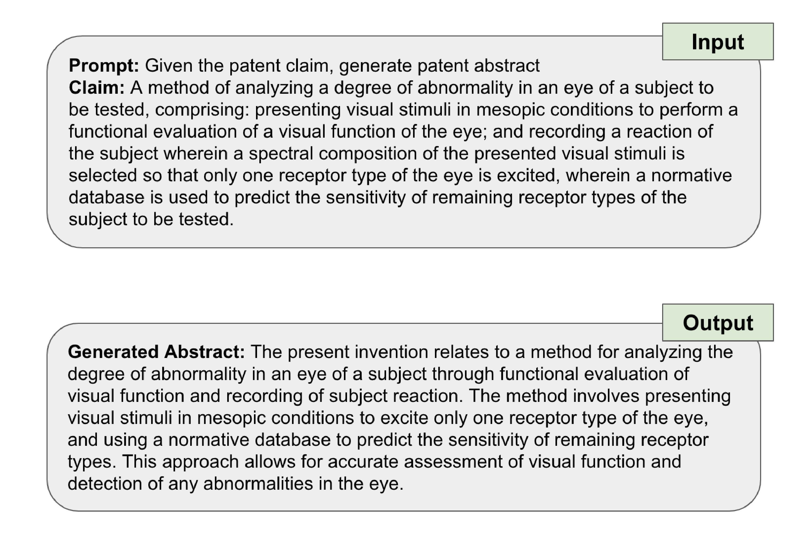

# ✍️ Patent Drafting with Large Language Models 
We aim for a paradigm shift for patent writing by leveraging LLMs
to facilitate the tedious patent-filing process.  We specifically focus on abstracts and claims by employing a zero-shot and few-shot approaches.

:boom: We generate abstracts of patents by utilizing the first claim
of each corresponding patent as an input for CPC subclasses A61, H04, and G06, and vice-versa. All the patents used in this paper are granted by the United States Patent and Trademark Office [USPTO](https://www.uspto.gov)  and obtained  from [PatentsView](https://patentsview.org/download/data-download-tables).

## Data
🔄 Data processing steps can be found  [here](https://github.com/hhshomee/patent_drafting/tree/main/Data%20Prep).

📄 Sample data can be found [here](https://github.com/hhshomee/patent_drafting/tree/main/Sample%20data). All the processed data has the following information as columns: patent_id, patent_abstract, patent_title, claim_text, cpc_subclass.

## Patent Generation 

We generate abstracts and claims of patents using models such as GPT-2, GPT-3.5, Llama2, and Gemini.

## Patent Tasks

Patent classification has been done using pre trained BERT model

For ranking we used BERT embedding and jaccard coefficient.

## Evaluation

To evaluate the generated abstracts, we employed the following NLP measures: BERTScore, BLEU, Rouge, and cosine similarity.

## Table: Evaluation of the generated abstracts by the NLP-based measures for the sub-classes in the **A61 (medical)** class

The models used here are Llama 2, GPT-2, and GPT-3.5. BERT-based metrics are constantly high across all subclasses. This demonstrates a strong performance of LLMs (best across models and measures are in green) in generating similar abstracts as the original ones. Llama 2 produces the best results (most number of green cells).

### Evaluation

To evaluate the generated abstracts, we employed the following NLP measures: BERTScore, BLEU, Rouge, and cosine similarity.

### Table: Evaluation of the generated abstracts by the NLP-based measures for the sub-classes in the A61 (medical) class

The models used here are Llama 2, GPT-2, and GPT-3.5. BERT-based metrics are constantly high across all subclasses. This demonstrates a strong performance of LLMs (best across models and measures are in green) in generating similar abstracts as the original ones. Llama 2 produces the best results (most number of green cells).

| Model  | CPC  | bert_F1             | cosine             | rouge_F1            | bleu_score          |
|--------|------|---------------------|--------------------|---------------------|---------------------|
| Llama 2| A61B |  0.88 ± 0.03 | 0.64 ± 0.17       | 0.43 ± 0.14         | 0.17 ± 0.13         |
|        | A61F |  0.88 ± 0.03 | 0.60 ± 0.19       | 0.39 ± 0.14         | 0.14 ± 0.12         |
|        | A61K | 0.85 ± 0.03         | 0.39 ± 0.17        | 0.28 ± 0.13         | 0.07 ± 0.08         |
|        | A61L |  0.87 ± 0.03 | 0.54 ± 0.19       | 0.37 ± 0.15         | 0.12 ± 0.12         |
|        | A61M |  0.88 ± 0.03 | 0.62 ± 0.19       | 0.41 ± 0.15         | 0.16 ± 0.13         |
|        | A61N |  0.88 ± 0.03 | 0.59 ± 0.18       | 0.40 ± 0.14         | 0.15 ± 0.13         |
|        | A61P | 0.85 ± 0.04         | 0.35 ± 0.16        | 0.26 ± 0.12         | 0.06 ± 0.07         |
|        | A61Q |  0.87 ± 0.03 | 0.47 ± 0.14       | 0.35 ± 0.14         | 0.12 ± 0.11         |
| GPT-2  | A61B | 0.82 ± 0.03         | 0.35 ± 0.17        | 0.20 ± 0.10         | 0.03 ± 0.06         |
|        | A61F | 0.81 ± 0.02         | 0.31 ± 0.17        | 0.18 ± 0.09         | 0.02 ± 0.02         |
|        | A61K | 0.81 ± 0.03         | 0.32 ± 0.14        | 0.18 ± 0.09         | 0.02 ± 0.04         |
|        | A61L | 0.81 ± 0.02         | 0.31 ± 0.14        | 0.19 ± 0.10         | 0.02 ± 0.05         |
|        | A61M | 0.82 ± 0.03         | 0.38 ± 0.17        | 0.22 ± 0.12         | 0.04 ± 0.09         |
|        | A61N | 0.82 ± 0.03         | 0.38 ± 0.16        | 0.22 ± 0.10         | 0.02 ± 0.04         |
|        | A61P | 0.80 ± 0.02         | 0.27 ± 0.15        | 0.15 ± 0.07         | 0.01 ± 0.03         |
|        | A61Q | 0.81 ± 0.03         | 0.32 ± 0.18        | 0.18 ± 0.11         | 0.03 ± 0.06         |
| GPT-3.5| A61B |  0.88 ± 0.02 | 0.59 ± 0.14       | 0.39 ± 0.10         | 0.12 ± 0.08         |
|        | A61F | 0.87 ± 0.02         | 0.52 ± 0.18        | 0.33 ± 0.11         | 0.07 ± 0.07         |
|        | A61K |  0.87 ± 0.03 | 0.46 ± 0.18       | 0.35 ± 0.13         | 0.10 ± 0.10         |
|        | A61L | 0.86 ± 0.02         | 0.48 ± 0.14        | 0.30 ± 0.10         | 0.06 ± 0.06         |
|        | A61M | 0.87 ± 0.02         | 0.50 ± 0.19        | 0.30 ± 0.10         | 0.06 ± 0.06         |
|        | A61N |  0.88 ± 0.03 | 0.56 ± 0.16       | 0.38 ± 0.11         | 0.11 ± 0.08         |
|        | A61P |  0.86 ± 0.03 | 0.37 ± 0.17       | 0.30 ± 0.13         | 0.06 ± 0.07         |
|        | A61Q |  0.87 ± 0.03 | 0.46 ± 0.20       | 0.33 ± 0.15         | 0.11 ± 0.11         |
| Gemini | A61B | 0.87 ± 0.05         | 0.56 ± 0.27        | 0.39 ± 0.21         | 0.16 ± 0.21         |
|        | A61F | 0.86 ± 0.04         | 0.54 ± 0.15        | 0.37 ± 0.19         | 0.14 ± 0.15         |
|        | A61K | 0.85 ± 0.04         | 0.37 ± 0.19        | 0.28 ± 0.16         | 0.08 ± 0.11         |
|        | A61L | 0.86 ± 0.04         | 0.50 ± 0.23        | 0.35 ± 0.18         | 0.12 ± 0.13         |
|        | A61M | 0.87 ± 0.04         | 0.54 ± 0.26        | 0.38 ± 0.20         | 0.13 ± 0.14         |
|        | A61N | 0.88 ± 0.04         | 0.58 ± 0.22        | 0.42 ± 0.16         | 0.16 ± 0.13         |
|        | A61P | 0.85 ± 0.06         | 0.36 ± 0.17        | 0.26 ± 0.14         | 0.06 ± 0.10         |
|        | A61Q | 0.86 ± 0.04         | 0.44 ± 0.21        | 0.34 ± 0.18         | 0.12 ± 0.13         |
